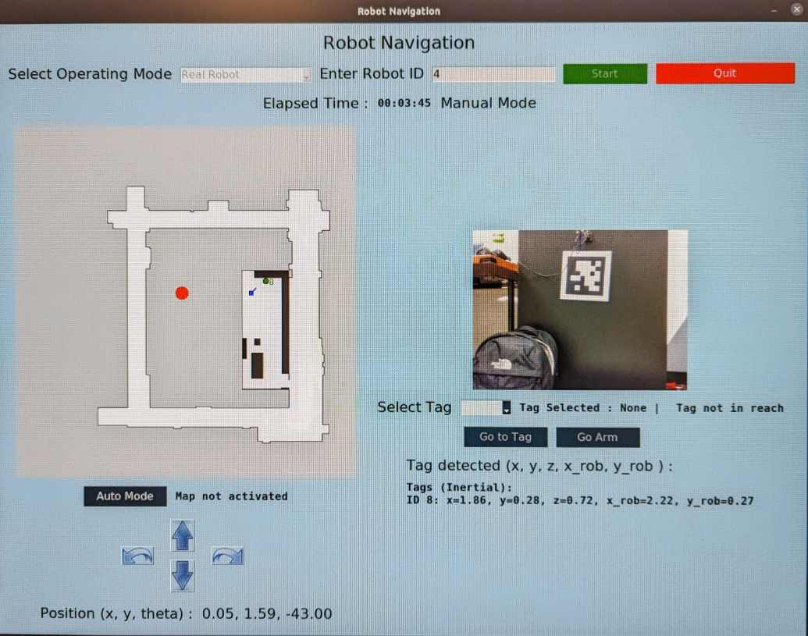

# README

# Application Launch Instructions

## Launching the Application
To run the application, navigate to the main folder and execute the following command in the terminal:
```bash
python3 src/map_GUI.py
```

## Installation Requirements

Ensure all packages listed in the requirements document are installed prior to running the application.t

To use PySimpleGUI, you need to obtain a license key. Please visit the following website and create an account to get your key:https://www.pysimplegui.com/


## Interface Preview 

Below is a screenshot of the application interface when connected to the robot in reql life.

